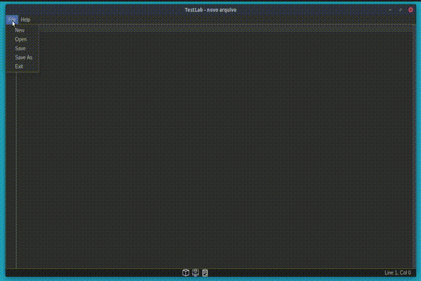

## Compilador para a LPD ( linguagem de programação didática )

**Projeto desenvolvido durante a disciplina de "Compiladores" realizada em 2020/2.**

*Autor: Marco De Nadai*

**Ferramentas Utilizadas:**

- IDE IntelliJ.
- Apostila de Compiladores, Ricardo Luís de Freitas.


**JAR Compilado:**

- [Releases Page](https://github.com/marcoadenadai/compilador/releases)

## Demonstração
**Gif demonstrando a compilação e execução de programa para cálculo fatorial:**



```
/*	[[ Programa demo feito na linguagem de programacao didatica LPD ]]

	- A LPD se assemelha muito a linguagem Pascal traduzida na lingua portuguesa.

	- O compilador TestLab foi desenvolvido 100% em Java.

	- Foi desenvolvido a partir dos principios de Linguagens Formais e Automatos.

	- Conta com analise lexical, sintatica e semantica.

	- Conta com processo de Geracao de Codigo, para execucao em MV.

	- A IDE inclui tambem uma maquina virtual para emular e debugar a execucao dos programas.    
*/

programa fatorial;
	var x:inteiro;
	
	funcao fat:inteiro;
		var w:inteiro;
		
	inicio
		se x = 1
	  		entao fat:=1 
	  	senao 
			inicio
	       		w := x;
	        		x := x - 1;
	        		fat:= w * fat;
	    		fim;
	fim;

inicio
	 leia(x;
	 {escreva(x);}
	 x:= fat;
	 escreva(x);
fim. 
``` 
demo.txt


|Input|Output|
|-|-|
|5|120|
|3|6|

#
